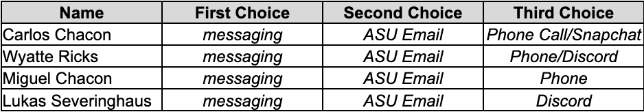
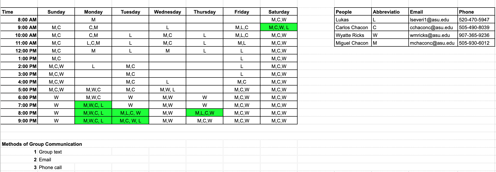

# Appendix A: Team Organization

## Communication Channels

In order to improve communication between team members and in order to better set up meetings and times, **Table 1** found below was filled out by the team members in order to determine any preference in terms of methods of communication.

**Table 1** Team Member Communication Methods
<figure class="image">
  

   
  

</figure>

## Communication Procedures

The team will create a group on a messaging app to communicate with each other. Any document, images, and other files that are difficult to share through messaging will be shared through the team member’s emails. 

## Meeting Schedule 

In **Figure 1** below, the weekly meeting availability for each team member can be found. Common meeting times are highlighted and represent times that will work best for team members.

<figure class="image">
  

   
  Figure 1 Team 202 Member Meeting Schedule
  

</figure>

## Meeting Coordination

The team will communicate through the previously accepted forms of communication and send reminder texts, email, etc. in order to keep each other accountable. Furthermore, any potential changes in meeting times, whether it be to add or change a time, will be communicated through the aforementioned communication methods so that everyone is informed about the changes and so that they are agreeable to all. In terms of meeting type, given that this will be a more hands-on and intensive project, meetings are preferred to be in-person, however, special exceptions that will be approved or discussed by the team ahead of time can allow for virtual meetings as well. Please try to notify the team of any potential changes or circumstances that could harm the team’s success or impact a meeting as soon as possible. Lastly, make sure to respond to all team/project-related questions/messages/emails as soon as possible.

## Team Coordination

With respect to turning in work, each team member will verbally acknowledge that they are comfortable/okay with the assignment submission. When splitting up tasks, the team will have the most adequate worker for the job to lead that specific task. If there are members in the team who do not know how to do the task, they will be brought up to speed by those who do know how. If none of the team members understand or know how to complete an assignment or aspect of the assignment, the TAs, profession, other groups, or online research will be explored in order to complete said task or assignment. Lastly, when feedback is provided, the team will make sure that each teammate receives and understands the feedback and each member of the team will be involved in determining ideas on how to improve or fix any problems or concerns presented by the feedback.

## Team Accountability

In terms of team accountability, the team members are responsible for checking up on each other and keeping each other accountable. Pink slips will be used if major setbacks or team success is severely harmed by lack of contribution/accountability. 

## Signatures

As a member of Team 202, by electronically signing below I agree to all terms and conditions listed within this charter and I acknowledge that the information provided is true to the best of my knowledge. 

Carlos Chacon  
Wyatte Ricks  
Lukas Severinghaus  
Miguel Chacon

[Back to Home](index)
