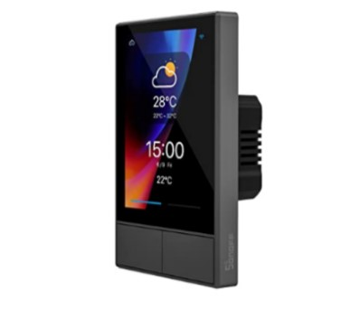
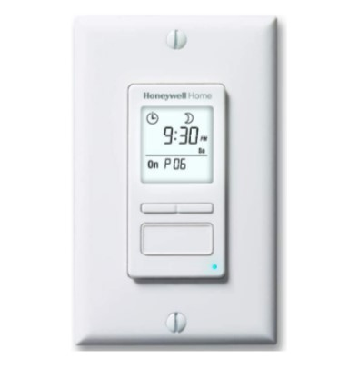
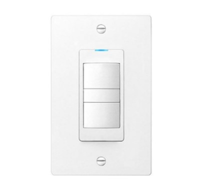
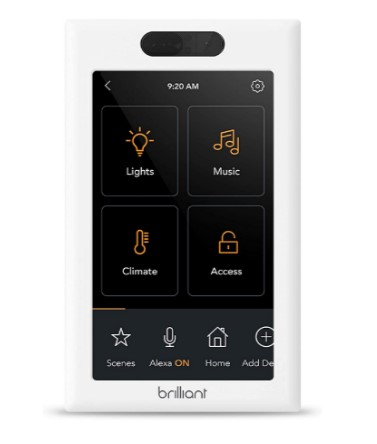
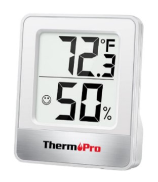

# Product 1

## SONOFF NSPanel Wifi Smart Scene Wall Switch

_**Keywords:**_ Temperature Light Switch

_**Search Results Link:**_

<figure class="image">
  

   
  

</figure>

_**Price:**_ $89.99

_**Description:**_ With a built-in powerful thermostat, you can set different indoor temperatures for different periods of time, and NSPanel will automatically trigger the heating or cooling equipment according to your setting conditions to keep the room at a comfortable temperature.

_**Positive Review User Needs:**_

-User states product is great for DIY.(latent)

-User states software was unusable. (explicit)

-User states the product had no physical switch to deal with and turned off to save power. (latent)

-User wishes had a proximity sensor to turn off when not present.(latent)

-User states work with custom software.(explicit)

-Customer state assistance is needed.(latent)

_**Negative Review User Needs:**_

-User Defines Product as unusable and impractical due to incompatibility with outlet blueprint. (explicit)

-User states the price was too good to be true.(latent)

-User states the product has false advertising and is no better than a normal light switch. (explicit)

-User states switch doesn’t dim the lights.(latent)

-User states product has software issues.(explicit)

-User states product has false advertisement.(latent)

 

# Product 2

## Honeywell Home RPLS740B ECONOswitch 7-Day Solar Programmable Switch

_**Keywords:**_ Smart Light Switch

_**Search Results Link:**_

<figure class="image">
  

   
  

</figure>

_**Price:**_ $49.99

_**Description:**_ Scheduled programming allows the Econoswitch to turn your home lights and motors on and off automatically, helping you save both time and energy.

_**Positive Review User Needs:**_

-User describes product as user friendly and easy to install.(explicit)

-User states interface navigation is easy to understand.(latent)

-User states the product had auto switching features.(explicit)

-User states the product was easy to install.(latent)

-Customer states the product lasts for a good amount of time.(explicit)

-User states product has a backup battery.(explicit)

_**Negative Review User Needs:**_

-User states program was not easy to set up and needed a video to understand.(explicit)

-User states the video guid was not easy to understand.(explicit)

-Customer states product customer care was poor.(explicit)

-User states the product kept resetting itself.(latent)

-User states the product doesn’t work at all.(Latent)

-User states the product is not worth the price.(latent)

 

# Product 3

## DewStop FS-875-W1 Adjustable Multi Timer Bath Fan Timer Control With Light Control, White

_**Keywords:**_ bathrrom ffan timer and light switch combo

_**Search Results Link:**_

<figure class="image">
  

   
  

</figure>

_**Price:**_ $44.00

_**Description:**_ This product is a multi timer fan control that includes an adjustable countdown timer and an adjustable minutes per hour timer. The countdown timer allows you to choose how long the fan will run and the minutes per hour timer allows you to turn the fan on every hour. The product includes manual bath fan control for immediate ventilation and manual light control to operate bathroom lighting. The Blue LED indicator light activates to let you know the fan is turned on.

_**Positive Review User Needs:**_

-Design should be simple and effective. (explicit)

-Design should have flexible control settings. (latent)

-Design should be easy to install. (latent)

-Design should be simple. (explicit)

-Design features should be intuitive. (latent)

-Design should include moisture sensors to optimize fan run time. (explicit)

-Design should look aesthetically pleasing. (explicit)

-Design should be easy to install. (explicit)

-Design should help remove excess moisture from the room. (explicit)

-Design should be made of corrosive resistant and quality materials. (latent)

-Design should be easy to operate. (latent)

_**Negative Review User Needs:**_

-The design should include flexible control settings. (explicit)

-The design should be made of quality materials. (latent)

-The design should have a long lifespan. (explicit)

-The design should look aesthetically pleasing. (explicit)

-The design should allow for easy accessibility to the control settings. (explicit)

-The product should have an efficient delivery process. (explicit)

-The design features should work as expected. (explicit)

-The design should be made of high quality materials. (explicit)

 

# Product 4

## Brilliant Smart Home Control (1-Switch Panel) — Alexa Built-In & Compatible with Ring, Sonos, Hue, Google Nest, Wemo, SmartThings, Apple HomeKit — In-Wall Touchscreen Control for Lights, Music, & More

_**Keywords:**_ Smart Switch

_**Search Results Link:**_

<figure class="image">
  

   
  

</figure>

_**Price:**_ $89.99

_**Description:**_ EASY SMART HOME CONTROL FOR EVERYONE: Brilliant touchscreen panels with built-in Alexa make it easy for everyone at home to control popular smart devices, lighting, cameras, locks, thermostats, intercom, scenes and more by simply replacing a light switch.

_**Positive Review User Needs:**_

-The device is easy to install (explicit)

-The device is adjustable to multiple outlets (explicit)

-The device is aesthetically pleasing (explicit)

-The device works with a variety of different systems and softwares (explicit)

-The device is relatively inexpensive (latent)

-The device incorporates high quality materials (latent)

-The device is easy to setup and install (explicit)

-The device works well with other smart home devices (explicit)

-The device centralizes many smart home devices (latent)

-The device has a seamless installation process and aesthetic (explicit)

-The device incorporates multiple functions (explicit)

-The device is customizable and kid friendly (explicit)

_**Negative Review User Needs:**_

-Device acts like a physical switch (explicit)

-Device incorporates colors (explicit)

-All the device functions work (explicit)

-The device does not require additional devices to properly function (latent)

-The device easily compatible with third party systems (explicit)

-The device is intuitive and incorporates human-centric interface (explicit)

-The device incorporates seamless integration with other devices (explicit)

-The device should be inexpensive (latent)

-The device is intuitive and incorporates human-centric interface (explicit)

-The device works consistently (explicit)

-The device’s wiring is adaptable (explicit)

-The device is easy to use (latent)

 

# Product 5

## ThermoPro TP49 Digital Indoor Humidity Meter Room Thermometer with Temperature and Humidity Monitor Mini Hygrometer Thermometer

_**Keywords:**_ humidity meter

_**Search Results Link:**_

<figure class="image">
  

   
  

</figure>

_**Price:**_ $8.99

_**Description:**_ This product is a combined humidity and temperature meter for household use. It has an indicator for current comfort level based on humidity, and updates every 10 seconds. It has a large LCD for easy reading.

_**Positive Review User Needs:**_

The device needs to be easy to power (latent)

The device needs to be easy to mount (explicit)

The device needs to be easy to read (latent).

The device’s interface should be minimalistic (latent).

The device must be sensitive (latent).

The device should be low cost (latent).

_**Negative Review User Needs:**_

The device needs to measure precisely (latent).

The device needs to be reliable (explicit).

The device must be able to survive in high humidity environments (latent).

The device needs to communicate its status clearly (latent).

The device must measure accurately (latent).

The device should be easy to handle (latent).

 

# User Needs Rated

_**Interface**_ 
⭐⭐Built in timer for display

⭐⭐Gauge readout of humidity

⭐Touch display

_**Customer Support**_ 
⭐⭐Easy to read

⭐⭐Communicate status clearly

⭐⭐Time warranty is reasonable

⭐Short delivery process

_**Intuitive to operate**_  

⭐⭐ Multi functional

⭐⭐Intuitive

⭐Acts like a physical switch

_**Cost**_ 

⭐⭐Relatively inexpensive

⭐Low cost

_**Reliability**_ 

⭐⭐Cold resistant

⭐⭐Heat resistant

⭐⭐Long lifespan

⭐Durable

⭐Wind resistant

⭐Survive high humidity

⭐Corrosive resistant

_**Interoperability**_ 

⭐⭐Easily compatible with third party systems

⭐⭐Works with a variety of different systems and softwares

⭐⭐Compatible with non-Alexa items

⭐⭐Remote activation

⭐Bluetooth capabilities

⭐LoRa

⭐Compatible with Alexa

_**Energy Efficient**_ 

⭐⭐Eco-friendly

⭐Auto switch

_**Measurement features**_ 

⭐⭐Motion detection

⭐Pressure measurement

⭐Presence detection

_**Easy to use**_ 

⭐⭐Easy to handle

⭐⭐Easily integratable

⭐Easy to program (if required)

⭐Easy to set up

_**Customizable**_ 

⭐⭐Easily removable

⭐⭐Flexible control settings

⭐⭐Multiswitch control

⭐Adhesive mount

⭐Keyhole mount

⭐Magnet mount to switch

_**Aesthetically pleasing**_ 

⭐⭐Lightweight

⭐⭐Not bulky

⭐⭐Color variations

⭐Incorporates colors

[Back To Home](index)