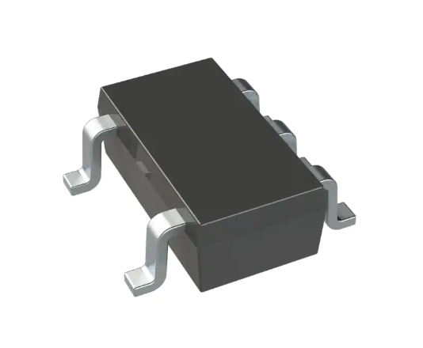
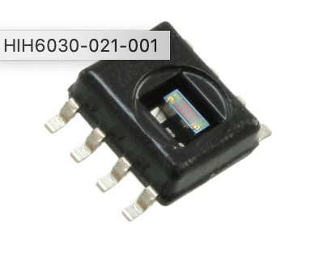

## Motor Drivers

<figure class="image">
  

   
  Figure 1 - AM4962GHTR-G1
  

</figure>

### Cost
- $0.37/each
### [Datasheet](https://www.diodes.com/assets/Datasheets/products_inactive_data/AM4962.pdf)

### [Digikey](https://www.digikey.com/en/products/detail/diodes-incorporated/AM4962GHTR-G1/7724835)

### Pros
- 3.5V to 16V 
- Used for single phase motors

### Cons
- Can only buy in bulk of 4000
- Datasheet says "Not Recommended for New Design"
 

<figure class="image">
  

   
  Figure 2 - DRV8830DGQR
  

</figure>

### Cost
- $2.41/each
### [Datasheet](https://www.ti.com/general/docs/suppproductinfo.tsp?distId=10&gotoUrl=https%3A%2F%2Fwww.ti.com%2Flit%2Fgpn%2Fdrv8830)
### [Digikey](https://www.digikey.com/en/products/detail/texas-instruments/DRV8830DGQR/2520903)
### Pros
- 5V to 20V
- Supports a wide range of motors
- Minimizes power dissipation

### Cons
- Low output voltage
- Extremely small size
 

<figure class="image">
  

   
  Figure 3 - L298P
  

</figure>

### Cost
- $12.75/each
### [Datasheet](https://www.st.com/content/ccc/resource/technical/document/datasheet/82/cc/3f/39/0a/29/4d/f0/CD00000240.pdf/files/CD00000240.pdf/jcr:content/translations/en.CD00000240.pdf)
### [Digikey](https://www.digikey.com/en/products/detail/stmicroelectronics/L298P/585919)
### Pros
- Drives relays, solenoids, DC and stepper motors
- 4.5V to 7V

### Cons
- Expensive
- Not a serial driver

## Motors
  

   
  

  Figure 4 - OD4010-05HB
</figure>

### Cost
- $12.36/each
### [Datasheet](https://media.digikey.com/pdf/Data%20Sheets/Orion%20Fans%20PDFs/OD4010.pdf)
### [Digikey](https://www.digikey.com/en/products/detail/orion-fans/OD4010-05HB/2621106)
### Pros
- 500mW
- 5V supply
- 10.5mm wide
- Variable speed control

### Cons
- Expensive for a small component
- Pulls too much current
 

<figure class="image">
  

   
  Figure 5 - SER0006 - Servo Motor
  

</figure>

### Cost
- $3.62/each
### [Datasheet](https://media.digikey.com/pdf/Data%20Sheets/DFRobot%20PDFs/SER0006_Web.pdf)
### [Digikey](https://www.digikey.com/en/products/detail/dfrobot/SER0006/7597224?utm_adgroup=Motors%20-%20AC%2C%20DC&utm_source=google&utm_medium=cpc&utm_campaign=Shopping_Product_Motors%2C%20Solenoids%2C%20Driver%20Boards%2FModules_NEW&utm_term=&utm_content=Motors%20-%20AC%2C%20DC&gclid=Cj0KCQiA8t2eBhDeARIsAAVEga1tQ2_MRK_ZuvTBrZQFvAZVM4fVOh2YmjY9mBGSyuwMvR2cvRgFpOMaAoY_EALw_wcB)
### Pros
- 4.5V with a working current of less than 500mA
- Small enough for a confined space
- Operational in -30 to +60 Celsius

### Cons
- Not linear in movement 
- Not the highest quality
 

<figure class="image">
  

   
  Figure 6 - DSOS-0416-05D
  

</figure>

### Cost
- $3.30/each
### [Datasheet](https://www.farnell.com/datasheets/3035560.pdf)
### [Digikey](https://www.newark.com/delta/dsos-0416-05d/linear-solenoid-5vdc-3-3w/dp/76AH8218)
### Pros
- Cheap
- .66A needed
- Linear Solenoid
- 5 VDC
- 3.3 W
- 7.55 ohm
- DSOS Series
- Intermittent
- Push

### Cons
- Minimal product description
- Minimal datasheet
- Minute movement
- 8g of push force
 

## Temperature Sensors
  

   
  Figure 7 - TC74A4-3.3VCTTR
  

</figure>

### Cost
- $1.09/each
### [Datasheet](https://ww1.microchip.com/downloads/en/DeviceDoc/21462D.pdf)
### [Digikey](https://www.digikey.com/en/products/detail/microchip-technology/TC74A4-3-3VCTTR/443268)
### Pros
- Surface Mount
- 2.7V-5.5V
- Digital
- Operating Temperature: -40℃ - 125℃
- I2C Output Type
- ±2℃ Accuracy
- Currently Have in Storage 
- Easy Wiring

### Cons
- Slight increase in price
- Local Sensing only
 

<figure class="image">
  

   
  Figure 8 - MAX6630MUT-T
  

</figure>

### Cost
- $2.75/each
### [Datasheet](https://rocelec.widen.net/view/pdf/jxqayngxhf/MAXMS10478-1.pdf?t.download=true&u=5oefqw)
### [Digikey](https://www.digikey.com/en/products/detail/rochester-electronics-llc/MAX6630MUT-T/12104653)
### Pros
- Surface Mount
- SPI Output Type
- Operating Temperature: -55℃ - 150℃
- 3-5.5V (can use on either 3.3V or 5V power supplies)
- ±0.8℃ Accuracy (most accurate)
- In-Stock
- Digital
- Can be shipped in 4 days

### Cons
- Must be bought in bulk
- Most expensive relative to other options
 

<figure class="image">
  

   
  Figure 9 - TMP112BIDRLR
  

</figure>

### Cost
- $2.41/each
### [Datasheet](https://media.digikey.com/pdf/Data%20Sheets/UTD%20Semi%20PDFs/TMP112B.pdf)
### [Digikey](https://www.digikey.com/en/products/detail/umw/TMP112BIDRLR/16705925)
### Pros
- Surface Mount
- 1.4V-5.5V
- Digital
- Operating Temperature: -55℃ - 150℃
- I2C Output Type
- ±0.1-0.5℃ Accuracy
- In Stock
- Can Ship Immediately 
- Easy Wiring

### Cons
- Slight increase in price
- Local Sensing only
 

## Humidity Sensors
  

   
  Figure 10 - HIH6130-021-001
  

</figure>

### Cost
- $22.98/each
### [Datasheet](https://prod-edam.honeywell.com/content/dam/honeywell-edam/sps/siot/en-us/products/sensors/humidity-with-temperature-sensors/honeywell-humidicon-hih6100-series/documents/sps-siot-humidicon-hih6100-series-product-sheet-009059-6-en-ciid-142165.pdf)
### [Digikey](https://www.digikey.com/en/products/detail/honeywell-sensing-and-productivity-solutions/HIH6130-021-001/2704701)
### Pros
- Surface mount
- Output is 14b
- Accuracy is  ± 4.0% RH
- Output type: I2C
- Extensive datasheet with Typical application circuit examples
- Meets project requirements

### Cons
- Very expensive
- Smaller operating temperature 
(-25C to 85C)

<figure class="image">
  

   
  Figure 11 - HIH6030-021-001
  

</figure>

### Cost
- $13.98/each
### [Datasheet](https://prod-edam.honeywell.com/content/dam/honeywell-edam/sps/siot/en-us/products/sensors/humidity-with-temperature-sensors/honeywell-humidicon-hih6000-series/documents/sps-siot-hih6000-datasheet-009073-7-en-ciid-147070.pdf)
### [Digikey](https://www.digikey.com/en/products/detail/honeywell-sensing-and-productivity-solutions/HIH6030-021-001/4291625)
### Pros
- Relatively Inexpensive
- Output Type: I2C
- Output 14b
- Surface Mount
- In stock, no lead time
- Extensive datasheet
- Meets project requirements
- Wide operating temperature range (-40C to 100C)

### Cons
- Less accurate than the other two options by 0.5% RH
- Does not have a built-in filter

<figure class="image">
  

   
  Figure 12 - HIH6131-021-001
  

</figure>

### Cost
- $24.61/each
### [Datasheet](https://prod-edam.honeywell.com/content/dam/honeywell-edam/sps/siot/en-us/products/sensors/humidity-with-temperature-sensors/honeywell-humidicon-hih6100-series/documents/sps-siot-humidicon-hih6100-series-product-sheet-009059-6-en-ciid-142165.pdf)
### [Digikey](https://www.digikey.com/en/products/detail/honeywell-sensing-and-productivity-solutions/HIH6131-021-001/2704702)
### Pros
- Relatively Inexpensive
- Output Type: I2C
- Output 14b
- Accuracy: ± 4.0% RH
- Surface Mount
- In stock, no lead time
- Extensive datasheet
- Meets project requirements

### Cons
- Very expensive
- Smaller operating temperature 
(-25C to 85C)
 

## 3.3V Power Regulators
  

   
  Figure 13 - RT8059GJ5
  

</figure>

### Cost
- $0.42/each
### [Datasheet](https://www.richtek.com/assets/product_file/RT8059/DS8059-06.pdf)
### [Digikey](https://www.digikey.com/en/products/detail/richtek-usa-inc/RT8059GJ5/2546006)
### Pros
- 1A output power
- Small size
- 1.5MHz switching frequency

### Cons
- 5.5V max input voltage
- Requires 3 capacitors, 2 resistors, and 1 inductor
 

<figure class="image">
  

   
  Figure 14 - PAM2401SCADJ
  

</figure>

### Cost
- $1.04/each
### [Datasheet](https://www.diodes.com/assets/Datasheets/PAM2401.pdf)
### [Digikey](https://www.digikey.com/en/products/detail/diodes-incorporated/PAM2401SCADJ/4898817)
### Pros
- Larger package to solder
- Step up for battery operation
- Adjustable 2.5-5V output
- 0.9V minimum input voltage

### Cons
- Requires 7 external components
- Step up only
- Needs additional pin to monitor power good indicator
 

<figure class="image">
  

   
  Figure 15 - MPQ4558DN
  

</figure>

### Cost
- $3.65/each
### [Datasheet](https://www.monolithicpower.com/en/documentview/productdocument/index/version/2/document_type/Datasheet/lang/en/sku/MPQ4558-AEC1/document_id/3864)
### [Digikey](https://www.digikey.com/en/products/detail/monolithic-power-systems-inc/MPQ4558DN-LF-Z/5293016)
### Pros
- 95% efficiency
- Wide input voltage, 3.8-55V
- SOIC package
- 2MHz switching frequency

### Cons
- Bottom heat dissipation pad
- Requires up to 10 external components
- High cost

[Back to Home](index)
