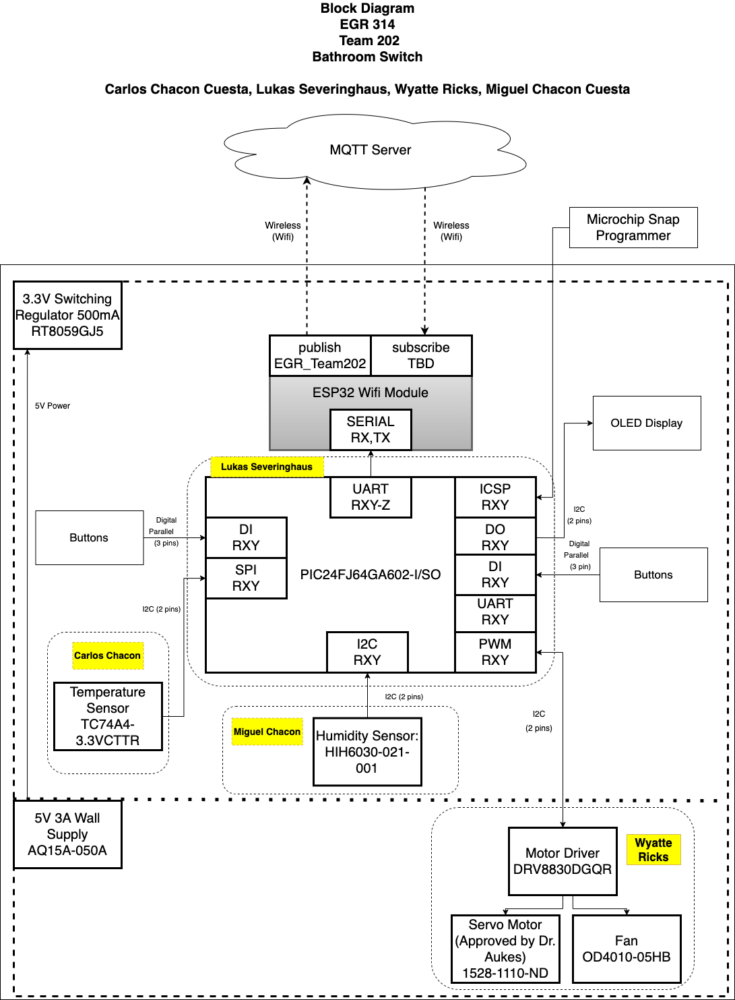

# Block Diagram
The block diagram helps to visualize and understand how all of the individual subsystem and passive components work and align together with the micro-controller. It is a simple first step before creating the individual and team schematics. 

### Current Block Diagram
<figure class="image">
  

   
  Figure 1 - Team 202 Block Diagram
  

</figure>

### Individual Subsystem

[Back to Home](index)