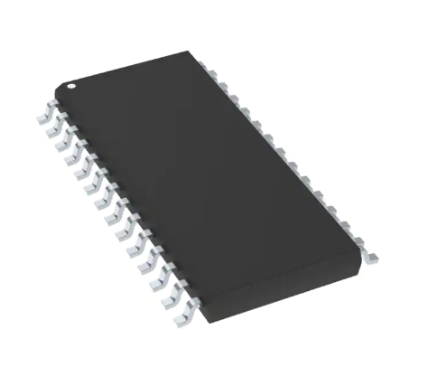
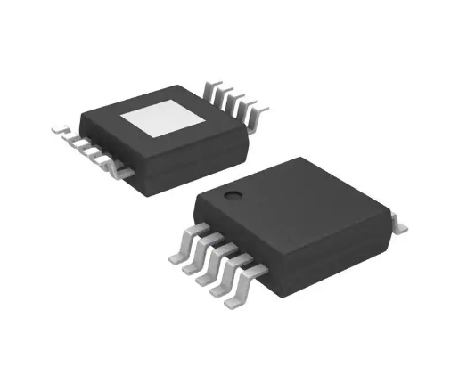
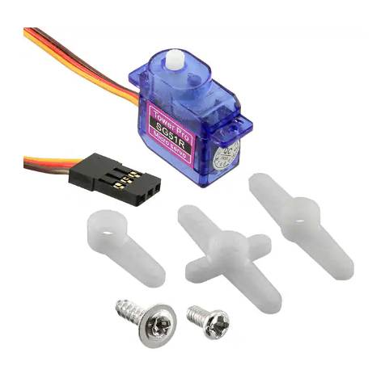
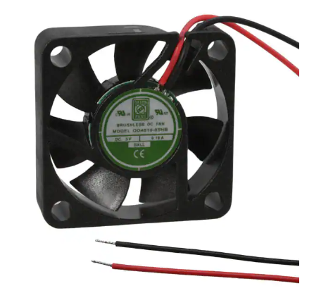
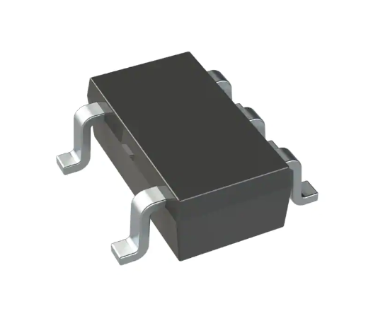
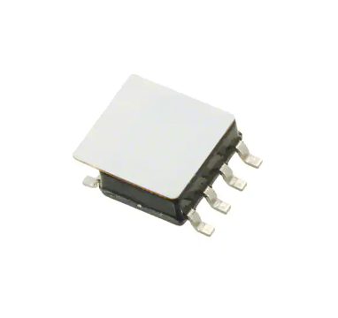
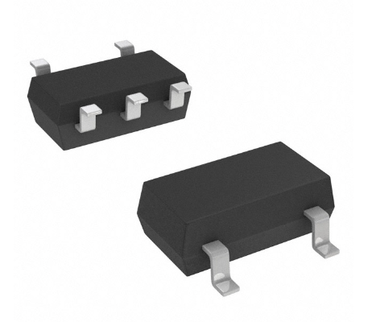

# Introduction

Having selected the second design concept from the design ideation process, the team created a list of different components that would fulfill both the project requirements and the selected design concept's function. This section will overview the specific components that were selected and the team's reasoning for choosing those components. The complete list of options can be found in [Appendix C](appendix-c-component-selection). 

_*All selected and researched components that will be attached to the board are surface mount*_

# Microcontroller selection
The project guidelines specified the team must use a Microchip PIC microcontroller. We selected and compared three different models to evaluate which would work best for our product, and settled on the PIC24FJ64GA702. 

<figure class="image">
  

   
  Figure 1 - PIC24FJ64GA702
  

</figure>

It comes in a 28 pin SOIC package, which is easily solderable, and had the largest program memory of the models we compared. Additionally, having two UART and three I2C peripherals ensures we can accommodate all the sensors and debugging interfaces necessary to ensure a smooth design process.

The complete selection table used for selecting the microcontroller is available in [Appendix D](appendix-d-microcontroller-selection). 

# Component selection
## Motor Driver

### DRV8830DGQR
<figure class="image">
  

   
  Figure 1 - DRV8830DGQR
  

</figure>

### Selection Reason
With the goal of our project being power efficiency and having an inexpensive product this motor controller provides efficient power distribution and an inexpensive option. Along with this comes the importance of flexibility when a motor may not work as planned.

## Motors

### SERVOMOTOR RC 4.8V
<figure class="image">
  

   
  Figure 2 - SERVOMOTOR RC 4.8V
  

</figure>
 <figure class="image">
  

   
  Figure 3 - OD4010-05HB
  

</figure>

### Selection Reason
With the solenoid's inability to produce sufficient force to turn the switch on/off, the servo motor (DOES NOT MEET REQUIREMENTS but approved by Dr. Aukes) is essential for carrying out this function. In order to meet project requirements, the fan will be used to apply variable speed control and direction for dependent states of the sensors present within the system. The fan will keep moisture out of the board and allow for more accurate sensor measurements.

## Temperature Sensor

### CTC74A4-3.3VCTTR
<figure class="image">
  

   
  Figure 4 - TC74A4-3.3VCTTR
  

</figure>

### Selection Reason
 Compared to the other options, this temperature sensor is the least expensive, which factors into its accuracy and operating temperature ranges. However, this sensor is currently in the team’s possession and as a result is the easiest to obtain. Furthermore, it works on 3.3V, is a surface mount component, and can use the I2C output type. In brief, this option will provide the necessary amount of performance and accuracy required to fulfill the project requirements.

## Humidity Sensor

### HIH6030-021-001
<figure class="image">
  

   
  Figure 5 - HIH6030-021-001
  

</figure>

### Selection Reason
The main reason for choosing this sensor is that it is half the price of the other two options and since one of the team’s goals is to make a product that is relatively inexpensive, cost plays such an important role in the component selection process. With a decrease in price, there is a loss in accuracy but not by a drastic amount. Another feature to note is that this sensor has a wider operating range than the other two which makes it more adaptable to different environments.

## 3V3 Power Regulator

### RT8059GJ5
<figure class="image">
  

   
  Figure 6 - RT8059GJ5
  

</figure>

### Selection Reason
As our application is going to be powered from a 5V source, option 1, the RT8059GJ5 switching regulator, makes the most sense. It balances current capability, size, and performance, with a minimum amount of external components. At $0.42 each, and a SOT package, it will reduce production costs and minimize the needed space on the PCB. Compared to the other options, this will provide the best results for the team project.

# Power Budget
Alongside the component selection process, the team built a power budget table, to ensure that there was sufficient power for all peripherals, actuators, and sensors. To simplify use of the design in a bathroom, we targeted using 5V for the main system power and 3.3V for logic. With a 5V 3A power source, we found we had sufficient available power, with margin, to power all the systems. 

The power budget table is shown below (also available directly [here](media/Power-Budget.pdf)):
<iframe src="media/Team 202 Power Budget V2.pdf" width="100%" height="500px"></iframe>

[Back to Home](index)