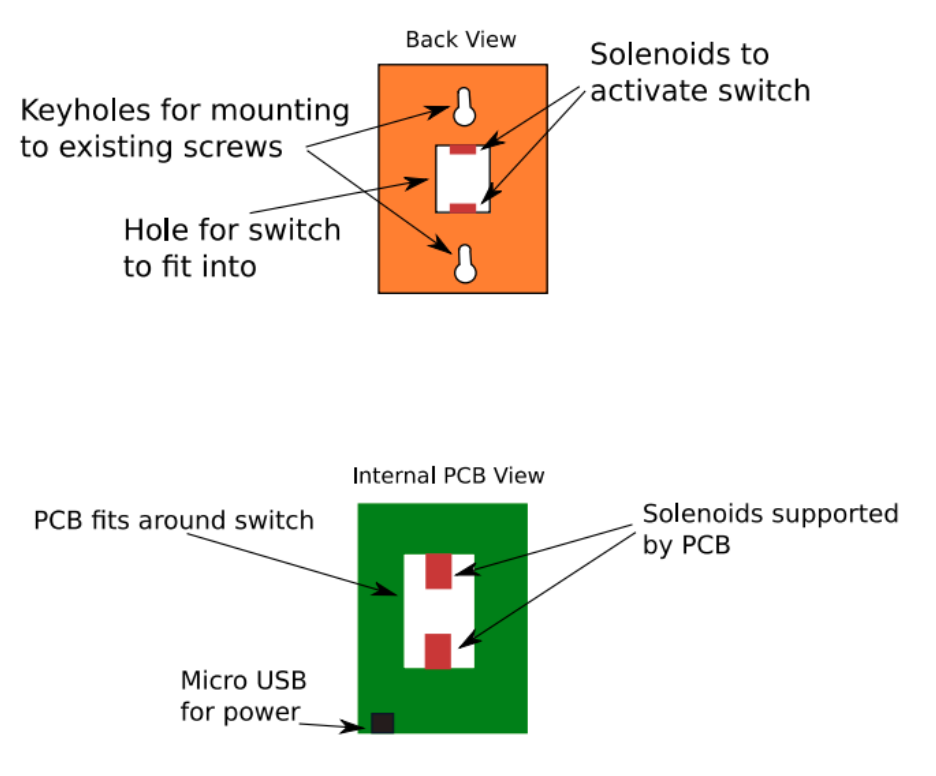

# Design Ideation

Before continuing with the design process, the team took some time to brainstorm design concepts on a jamboard. Each sticky note represented a way to execute a particular aspect of the design like a sensing method or actuation device as seen in **Figure 1**. The team decided it would be more effective to do individual brainstorming rather than group brainstorming due to the time constraints of the assignment as well as each team member having conflicting schedules. The brainstorming session of each member proved successful as each member contributed 25 distinct design ideas to the jamboard for a total of 100 different design ideas. Group brainstorming might have helped generate more unique ideas since members could bounce ideas off of one another and would have been the teams primary option. These ideas were then sorted down into several categories and distilled into three design concepts as seen in **Figure 2** and **Figure 3**. This process was completed by Carlos Chacon and Miguel Chacon. The concepts represented three unique ways to approach the user needs; each with a different combination of technical aspects and specific feature implementations. Finally, in order to best communicate these concepts, the team developed visual representations of them. These depictions will be used further on in the design process to gather feedback and inform future design decisions.

### Step 1: Initial Brainstorming
<figure class="image">
  

   
  Figure 1 - List of 100 Design Ideas
  

</figure>

### Step 2: Grouped Design Concepts
<figure class="image">
  

   
  Figure 2 - Design concept ideas grouped with overarching concept idea marked in blue
  

</figure>

### Step 3: Product Concept Groups
<figure class="image">
  

   
  Figure 3 - Design concept ideas grouped with overarching concept idea marked in blue
  

</figure>

## Design Concepts

After the team generated the three distinct design concept categories to approach the user needs, it was time to move onto the next step and create visual designs of the concepts in order to better understand how each device would function. This will be crucial as it will allow the team to make more thoughtful and practical decisions regarding which concept to choose and work on. 

The three design concepts are as follows: a multipurpose smart switch (**Figure 4**), practical switch (**Figure 5.0- 5.1**), and energy conserving switch (**Figure 6.0-6.3**). Furthermore, each design concept includes arrows pointing to the concept ideas that were grouped with the design. Miguel Chacon designed the multipurpose switch, Lukas Severinghaus designed the practical switch, and Wyatt Ricks designed the energy conserving switch. 

### Design 1
<figure class="image">
  

   
  Figure 4 - Multipurpose Switch
  

</figure>

Design 1 depicts a more advanced design of what the solution could look like: a multipurpose smart switch. The main concept for this design was a Tesla tablet but for the bathroom. This design is composed of a touch screen where the user can manually control the fan, automate the fan through the timer feature, and check the temperature and humidity of the bathroom. The device also comes with an integrated speaker and bluetooth capabilities if the user wants to listen to some music. There is also a night light to allow for some visibility at night. This concept meets the user needs of multi-functionality, simplicity, and incorporation of advanced technological features.

### Design 2
<figure class="image">
  

   
  Figure 5.0 - Practical Switch
  

</figure>

<figure class="image">
  

   
  Figure 5.1 - Practical Switch (cont.)
  

</figure>

Design 2 depicts a more simplistic approach to meeting the user needs with less features, but still successfully meets the user needs. This design comes with an OLED screen that allows the user to see the temperature and humidity of the bathroom. The device also comes with a timer function, which will allow the user to push a button and have the fan turn on for a set amount of time. The faceplate of the device would also be customizable to make it compatible with a range of bathroom settings. The key feature of this design is that the device is mounted on top of the existing light switch and the switch itself is flipped using a set of servo motors. Furthermore, a fan will be attached to the device that will allow for more accurate temperature and humidity readings. This concept meets the user needs relating to simplicity, customization, and functionality.

### Design 3
<figure class="image">
  

   
  Figure 6.0 - Energy Conserving Switch
  

</figure>

<figure class="image">
  

   
  Figure 6.1 - Energy Conserving Switch (cont.)
  

</figure>

<figure class="image">
  

   
  Figure 6.2 - Energy Conserving Switch (cont.)
  

</figure>

<figure class="image">
  

   
  Figure 6.3 - Energy Conserving Switch (cont.)
  

</figure>

Design 3 is similar to design 2, but energy conservation plays a bigger emphasis. Like design 2, design 3 is attached to an existing switch, but instead of attaching to the fan switch, it attaches to a light switch using a rail design. In terms of functionality, the device includes timer dial to control the length of time the fan is on as well as slide controls if the user wants to control other appliances from a singular point of contact. To conserve power, this design does not include an LCD or OLED screen, which results in some loss of functionality since the user will not be able to see the readings from the humidity and temperature sensors. This device, however, is flexible in that it allows the user to connect other appliances to it and control them using slide controls. This concept meets the user needs of customization, versatility, and energy conservation.  

[Back to Home](index)