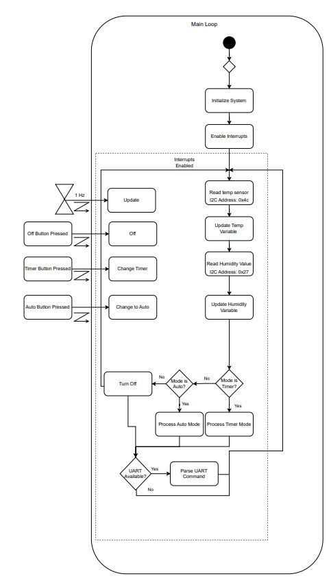
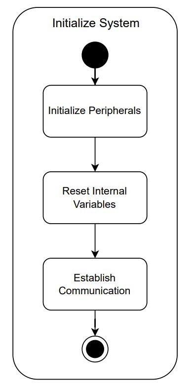
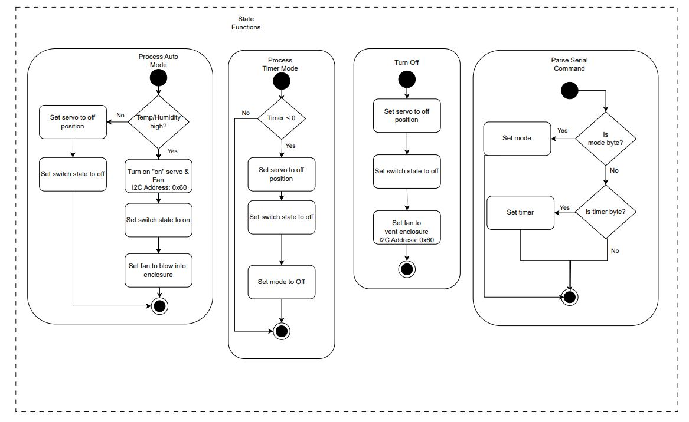
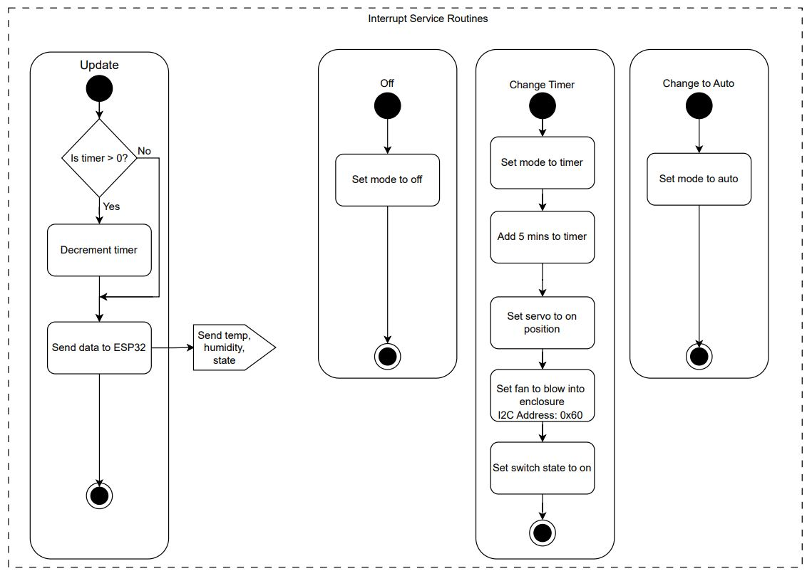

# Final Software Implementation

## Updated Software State Flow Diagram
Below is the updated software diagram reflecting the final design. There were a few small changes between our initial and final diagrams, but overall the core remained the same. One of the biggest changes was moving the OLED to be connected to the ESP32, instead of the PIC. This reduced the computational load on the PIC and simplified the software for this. 

<iframe src="media/Final-Software-Proposal.pdf" width="100%" height="500px"></iframe>

## Software State Flow Function
Breaking down each of the sections from the above diagram, the main loop forms the core of the decision logic, see figure X.1. After initializing the peripherals and variables, see Figure X.2, it enters an infinite loop.

In this loop, first the temperature and humidity sensors are polled, then a state machine runs the processing function for the current mode. There are three system modes. Off mode leaves the switch in the off position and the fan in the slow speed. Timer mode leaves the switch and fan on for a set amount of time. Auto mode automatically turns on the switch and fan based on the current measured humidity. 

After processing the state functions, the loop also checks for new inbound serial data. The serial commands can either contain a mode command, to switch to a new mode, or a timer command, to set the timer to a specific time. Once this process is complete, the loop begins again.
 
<figure class="image">
  

   
  Figure 1 - Main System
  

</figure>

<figure class="image">
  

   
  Figure 2 - Initialization
  

</figure>

The state functions have already been touched on briefly, but they implement the logic of each mode. The auto mode contains the main controller logic, which implements a bang bang controller with hysteresis. The hysteresis ensures the controller doesn't oscillate around the humidity setpoint. 

<figure class="image">
  

   
  Figure 3 - State Functions
  

</figure>

To ensure the system responds promptly, user inputs are processed via interrupt service routines (ISR), attached in the main loop startup. These ISRs get called whenever a button is pressed, and call the necessary logic to change modes or increment the timer. 

One final ISR is called on a 1Hz timer and it serves to count down the clock in timer mode, and send updates to the ESP32. This ensures that MQTT gets updated consistently and that the information on the screen is up to date. 

<figure class="image">
  

   
  Figure 4 - Interrupt Service Routines
  

</figure>

## Changes to software design

1) **Simplification of the inbound serial protocol.** Initially, we designed a multi byte communication protocol with a start and end byte, that would ensure reliable communication from the ESP32 to the PIC. This proved too difficult to implement as we encountered issue parsing multiple bytes reliably on the PIC. Instead, we moved to a simplified one byte protocol, where three state of the byte could indicate a mode change, and a range of other states would indicate a change in the timer count, see Figure 3. 
2) **Moving the OLED display from the PIC to the ESP32.** At the start of the project, we anticipated driving the OLED display from the PIC, however we moved it to be driven by the ESP32 as the Micropython library was much easier to use. This simplified control of the display and abstracted it to a simple API. 
3) **Controlling the servo.** We chose to use a RC servo to control the light switch, however we were not able to get the PIC's PWM module to function properly for our application. Instead of struggling with it further, we adjusted our software design to bit bang the servo control, which worked well enough for our application.
4) **Incrementing time behavior.** We initially designed the user interface to increment time by 5 minutes, snapping to the nearest increment when the timer button was pressed for the first time. However, in practice, this was incredibly unintuitive. Instead, we simplified the controls to just add 5 minutes to the current timer. Without the time snapping, the interface became much easier to navigate.  
5) **Controller hysteresis.** We first thought about using a bang-bang controller to actuate the light switch. This made sense from a control perspective as we had a binary output, however the base bang-bang controller would degrade due to noise in the sensor measurements around the setpoint. To combat this, we added hysteresis to the controller, to turn on the switch and fan at an upper setpoint and turn it off at a lower setpoint. This prevents the system from oscillating as the sensors move around a single setpoint.

## Future potential changes
The system as it stands is fairly feature rich. When combined with the IOT MQTT Panel app, we have a good user experience for both remote and local users. Looking back on the entire project, from a software standpoint, there are three areas we would consider for future improvement. 

First, we would rework the serial communications. The one byte serial protocol, while functional, is limited in that it has a limited number of states, and can be susceptible to signal noise. Instead moving to a robust protocol with header bytes and checksums would ensure more communication options, including more precise control of the timer, and open the door for additional command inputs. To implement this, we would develop a protocol scheme between the ESP32 and PIC, and revisit the serial parsing code to accurately capture multi-byte transmissions. With the transmissions received, we would parse these into the different possible commands, see Figure 3. 

On the topic of additional commands, the second change we would make would involve adding more configurability. Currently, the controller setpoints are hardcoded in software, and the servo positions for on and off are pre-set. With the serial communication changes, we could add additional topics to set the minimum and maximum temperature and humidity setpoints, as well as the servo positions. It could also be extended to change things like the timer increment and the max timer length. Retained topics in MQTT could let us store this configuration on the broker then restore them after a reboot, so we wouldn't have to store them in memory. These changes would involve moving a few values from static definitions to variables, then extending the serial parsing to accommodate additional commands. 

One of the final changes we would make would be to the servo control code. As previously mentioned, we weren't able to get the PWM peripheral to control the servo, so we would look more into why this didn't work and try to make it function. Without a consistent position pulse, the servo motor can be a bit jittery, so this would help ensure smoother motion. To implement this, we would revisit the PWM peripheral and change the existing bit banging code to instead adjust the duty cycle of the PWM module. 

One final, bonus item would be to revisit the debug output. Currently, debug messages are routed through the ESP32 to MQTT, where they are published on a non-listed debug topic. This is not ideal as it increases the amount of network traffic and exposes data that the user doesn't need. Instead, we would consider how to switch the `printf` function to redirect it between multiple UART peripherals. This would allow us to `printf` to one peripheral to send data to the ESP32 and `printf` to another peripheral that was only used for debugging. Microchip has instructions on how to do this, we would just need to consider how the change would affect the code structure and the use of UART printing in interrupts, see Figure 4. 

## MQTT Topic Table
We developed the below topic table to document the specific topics used to publish data and receive commands from MQTT. 

<iframe src="media/Final-Topic-Table.pdf" width="100%" height="500px"></iframe>

## C Source Code
Below are all the source files used for the PIC code. The full project and ESP32 code are visible on our code [repository](https://github.com/egr314-team202/project-code).

### Main file

### I2C Driver
We had to modify code we found to build an I2C driver for the PIC24 as it was not compatible with the existing I2C examples we had.

### Project Functions
Most of our main functionality is abstracted into the project functions files, to keep the `main.c` file clean.

