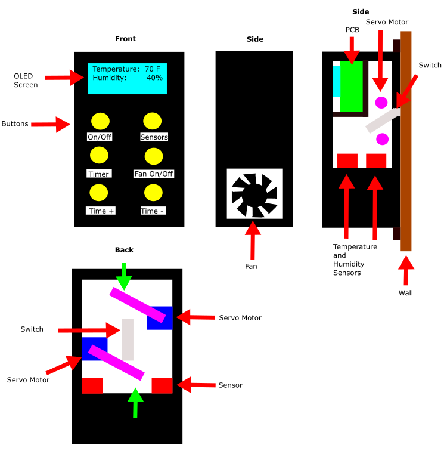

# Selected Design

The team ended up selecting design 2 as the final design. This decision was composed of several factors. Design 1, for example, best met the user needs but far exceeded the project requirements. The project would have taken much longer to successfully complete than the amount of time given due to its complexity. On the other side of the spectrum, design 3 did not meet enough of the main user needs such as the inclusion of an OLED screen. Furthermore, the flexibility of having several appliances to control from one place was ideal, but would have resulted in a complex process to install from the point of view of the user. A complicated and difficult installation is the main reason why design 3 was not selected. 

Design 2 was selected because it offered a balance between design 1 and design 2. It provides a high level of functionality by allowing the user to see the temperature and humidity values through an OLED screen, having a timer setting for automated fan control, and buttons for manual fan control. A key feature about this design is its ability to easily install the device by placing it on top an existing switch. Another feature that is important to note is the customizable faceplate. This will increase the versatility of the device as it will allow users to choose a faceplate based on the room's wall color. 

The team decided to make a couple of changes to design 2 to better optimize its functionality. The first change was replacing the solenoids with servo motors. The team realized that while the solenoids did fit the device's size constraint, they did not produce the amount of power necessary to flick a switch repeatedly. Servo motors, on the other hand, produce more torque and durable thereby better meeting the user needs and project requirements. The second change the team decided to make was to add a fan to the side. The purpose of the fan is to blow air through the device so that the sensors can get a more accurate reading of the temperature and humidity of the room. 
<figure class="image">
  

   
  Figure 1 - Selected Design
  

</figure>