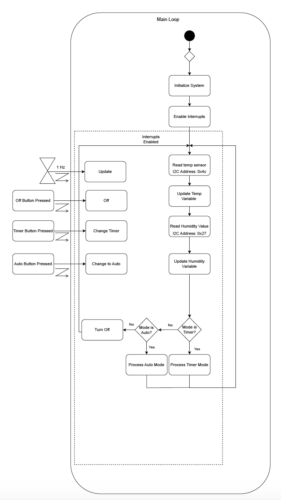
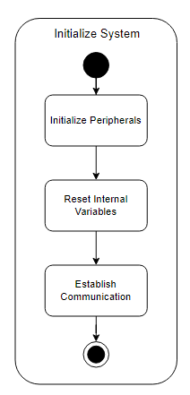
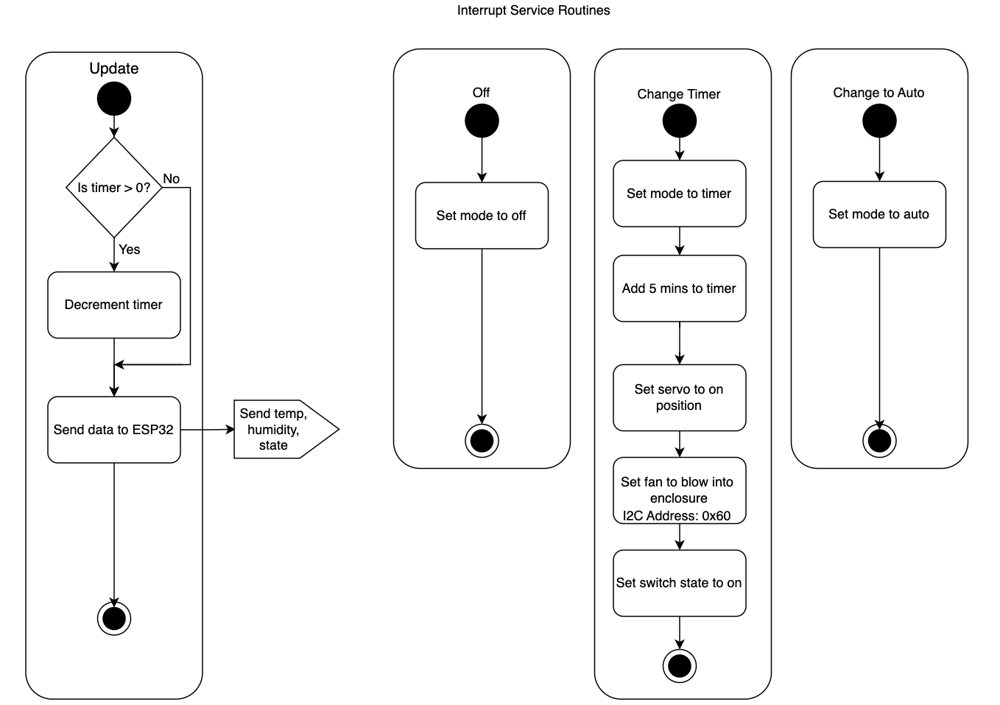
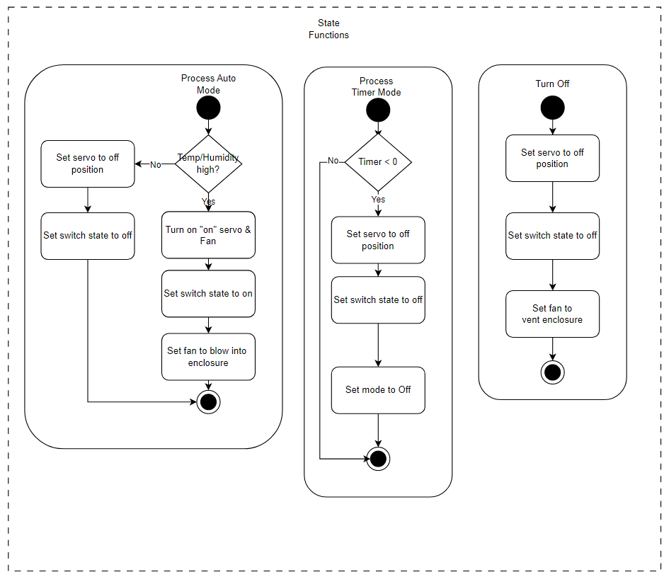

# Software Proposal

For the further progress of our team design we need a blueprint of the software used within our system. To lower the time and debugging of code a diagramed plan for coding our system will allow less error and more time for hardware designing. Below is the in-depth understanding of how our software will run to produce the user friendly outcome we plan to achieve. 

 

 ### Software Functionality

 

To equip ourselves with success we put together these blocks of important detail in functionality of system code. The Main Loop, which holds all important functions and variables, displays many key components to how we will achieve smooth functionality and proper user response. Within this main loop is the Initialization of the important variables, internal peripherals, and communication channels. As mentioned within the main loop are components such as the interrupt system and functions. The Interrupt Service Routine is key to establishing proper routine of communication between I2C channels with chips like the Motor Controller or the Temp and Humidity Sensor. These will be in connection to properly control the already installed ventilation system and the on board fan built within our design. These interrupts will be within the State Functions that are the state of how each component will react and function within the product. Each of these described aspects of the software design are shown below in **Figures 1** through **4**.

<figure class="image">
  

   

  **Figure 1** - Main Loop
  
  

</figure>

Shown above in **Figure 1** is the Main Loop of our software. Within the main loop it goes through a step by step process of first initializing the system (**Figure 2**) and enabling the interrupts (**Figure 3**). After these steps are completed, it then proceeds to read along the I2C channels the Temp Sensor and Humidity Sensor. Once read these two components variables will be updated to then be processed to run through a short series of logic gates to determine wether to turn the fan onto Auto, Time interval, or Off mode. These different modes are key to the goal in which we look to achieve with our users intentions of a clean and efficient environment. These modes can also be accessed through Web and the pressing of labeled on-board buttons. 

<figure class="image">
  

   

  **Figure 2** - Initialize System

  

</figure>

For the main loop to properly initiate certain functions and read data the initialization of the system is important for resetting and counting variables and more. In **Figure 2** above you can see these three important initialization take place within the beginning of the main loop. 

<figure class="image">
  

   

  **Figure 3** - Interrupt Service Routine
  
  

</figure>

Within the main loop also rests the Interrupt Service Routine as seen in **Figure 3**. As seen it is apart of the logic gate dependent on data received from the sensors present within the system. It first updates the logic gate variables and reads the state of each variable to determine the operation of the ventilation system control. If the internal clock state is "Yes" it will then either continue or set the count down determined by the temperature and humidity present. If the clock state is "No" then the operation of the ventilation system will be changed to Auto or Off dependent on the variables present. 

<figure class="image">
  

   

  **Figure 4** - State Functions
  
  

</figure>

Finally within the software lies the State Functions seen in **Figure 4**. Dependent on the temp or humidity of the present area the Process auto mode will determine the state of the ventilation system. This is achieved by the small movements within the design using a servo motor to turn the switch "on" or "off". Along with the servo motor function the Fan will be operating in direction with what the humidity and or temperature within the area is, to allow accurate readings from the two sensors present and for keeping the moisture away from the electrical components. These two directions of the Fan are labeled as blow, for accurate reading, and vent, for the desiccation of the electrical hardware. Other functions such as the Process timer mode will either turn the motor on or off due to the state of the clock set for ventilation operation. Along with the Off Mode which simply turns the system off. 

[Back To Home](index)