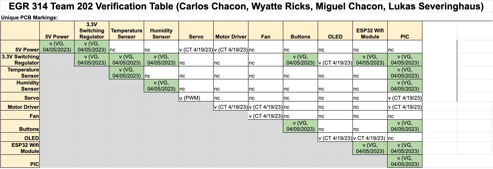

# System Verification
In order to easily identify which components of the final board were correctly soldered and programmed, the team developed a system verification table that listed all the different components and whether or not they were connected to each other. Then, both the teaching team and the project team reviewed each connection and verified that it worked. This process broke down the final PCB into easy to check subsystems and allowed for a more organized method for verifying the overall board's functionality. The final verification table implemented by the team can be found in the Figure below.

<figure class="image">
  

   
  Figure 1 - Final Verification Table
  

</figure>

### Note:
The squares annotated with "nc" represent components that are "not connected" with each other and therefore do not require verification. 

[Back to Home](index)