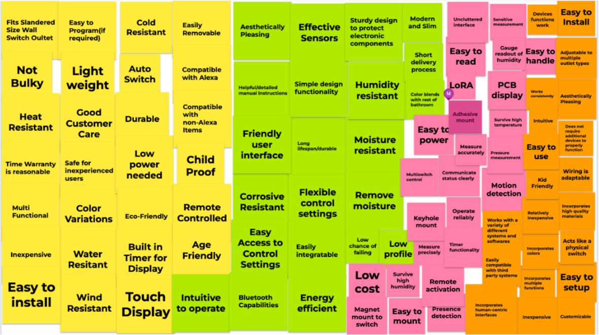
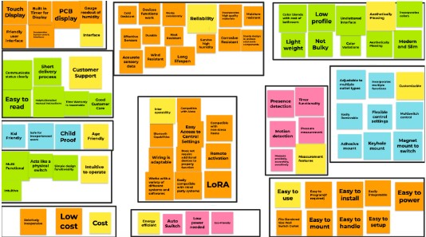
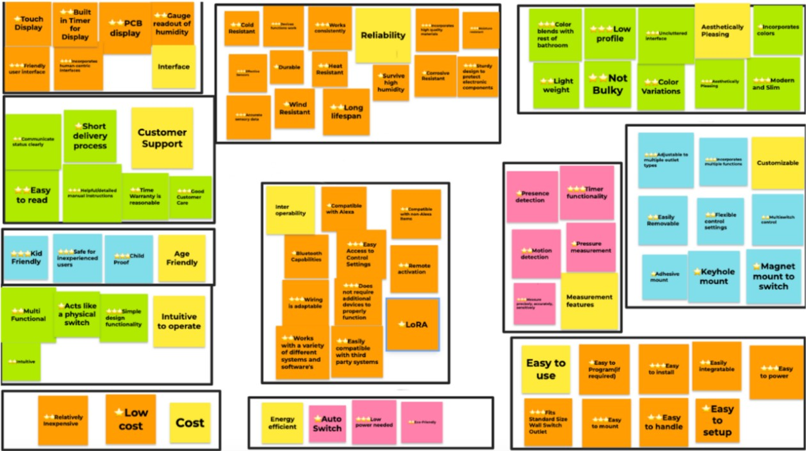

# User Needs and Benchmarking

In order to develop the requirements for the product, the team first analyzed the market for current solutions to the problem of accumulating moisture in confined spaces. A majority of the solutions were smart switches that revolved around bathrooms and smart technologies affecting the ventilation and temperature setting systems. The different solutions were analyzed and their top positive and negative reviews were recorded and then evaluated for explicit or latnent user needs. These user needs would then be used for benchmarking the product. As seen in _**Appendix B**_ five products that were analyzed along side important information and the user needs that were extracted form the positive and negative reviews.

## User Needs Evaluation

Having gone through different products and customer reviews that target the product statement, Team 202 generated a combined list of User Needs. This list consists of features and needs that customers liked, asked for, or complained about in the product reviews regarding the different multifunction switches above. The generated User Needs can be found below in _**Figure 1**_.

<figure class="image">
  

   

  _**Figure 1**_ - User Needs
  

</figure>

The next step was to group the user needs into separate categories to develop overarching need statements. The groups can be found in the below _**Figure 2**_ and the overarching need statements are highlighted in yellow.

<figure class="image">
  

   

  _**Figure 2**_ - Overarching needs
  

</figure>

Once the User Needs were sectioned off into different categories as seen in _**Figure 2**_, each User Need was then ranked from Least Important to Most Important. This ranking can be found in _**Figure 3**_.

<figure class="image">
  

   

  _**Figure 3**_ - Ranked User Needs where: ⭐⭐⭐ - Most Important; ⭐⭐ - Important; ⭐ - Least Important
  

</figure>

The process in which the team tackled this task was simple and productive. With each team member contributing to the user analysis each member would pull from their analysis and produce at least twenty-five user needs. As seen in Figure 1 through Figure 3 this process of breaking down user needs was fast and efficient. 

 

## Mega Needs

Below is a list of mega needs that the have been found from user analysis. From these mega needs will stem requirements for our project design. All other user needs can be found in _**Appendix B**_. These needs were decided based on if it follows our goal and if the aspect of the user need was important for user safety or user interaction. 

_**Interface**_ 
⭐⭐⭐Friendly user interface

⭐⭐⭐Incorporates human centric interfaces

_**Customer Support**_ 

⭐⭐⭐Good customer care

⭐⭐⭐Helpful/detailed manual/instructions

_**Age friendly**_ 

⭐⭐⭐Kid friendly

⭐⭐⭐Safe for inexperienced users

⭐⭐⭐Child proof

_**Intuitive to operate**_  

⭐⭐⭐Simple design functionality

_**Reliability**_ 

⭐⭐⭐Accurate sensory data

⭐⭐⭐Effective sensors

⭐⭐⭐Device’s functions work

⭐⭐⭐Works consistently

⭐⭐⭐Sturdy design to protect electronic components

⭐⭐⭐Incorporates high quality materials

⭐⭐⭐Moisture resistant

_**Interoperability**_ 

⭐⭐⭐Easy access to control settings

⭐⭐⭐Does not require additional devices to properly function

⭐⭐⭐Wiring is adaptable

_**Energy Efficient**_ 

⭐⭐⭐Low power needed

_**Measurement features**_ 

⭐⭐⭐Timer functionality

⭐⭐⭐Measure precisely, accurately, and sensitively

_**Easy to use**_ 

⭐⭐⭐Fits standard size wall switch outlet

⭐⭐⭐Easy to mount

⭐⭐⭐Easy to install

⭐⭐⭐Easy to power

_**Customizable**_ 

⭐⭐⭐Adjustable to multiple outlet types

⭐⭐⭐Incorporates multiple functions

_**Aesthetically pleasing**_ 

⭐⭐⭐Color blends with the rest of the bathroom

⭐⭐⭐Low profile

⭐⭐⭐Uncluttered interface

⭐⭐⭐Aesthetically pleasing

⭐⭐⭐Modern and slim

